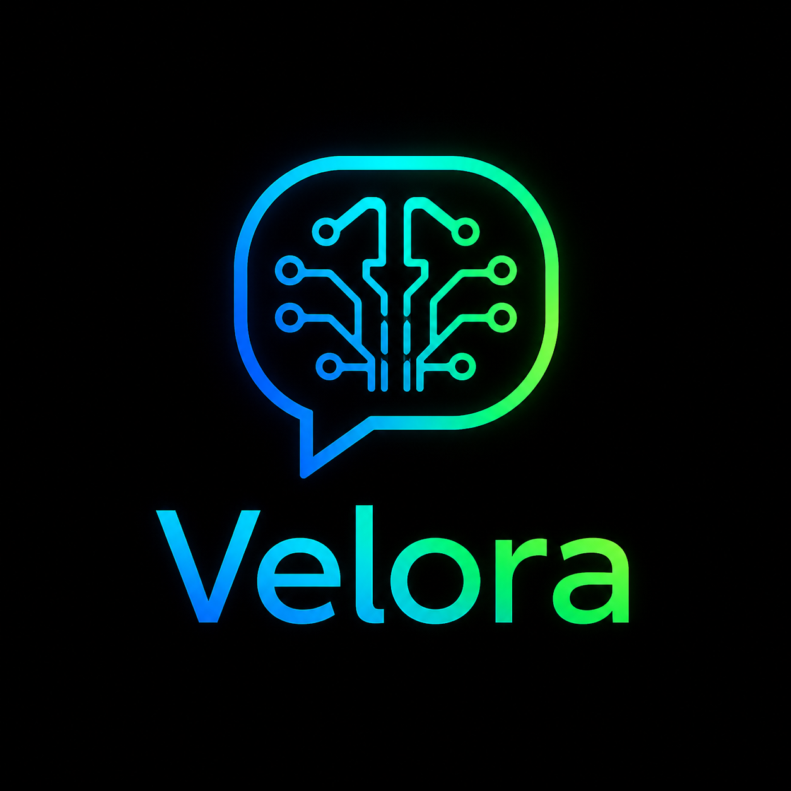

<p align="center">
  
</p>

<p align="center">
  
  
  
</p>

## APLICACION DE CHATBOT CON AI
Esta es una aplicacion de chatbot para Android utilizando inteligencia artificial, 
desarrollada con Flutter. El chatbot es capaz de responder a preguntas 
y mantener conversaciones de manera natural.
Ademas gracias a la arquitectura aplicada puede variar los modelos de 
AI.

## Dependencias DEV
Cambiar Splash Screen
```
- flutter pub add flutter_native_splash
- dart run flutter_native_splash:create
- Configuraciones en el main:
    WidgetsBinding widgetsBinding = WidgetsFlutterBinding.ensureInitialized();
    FlutterNativeSplash.preserve(widgetsBinding: widgetsBinding);
    Cuando la app se contruya colocar: 
    FlutterNativeSplash.remove();
```

Go Router
```
flutter pub add go_router
```

Image Picker(Seleccionar imagenes de la galeria y tomar fotos)
```
flutter pub add image_picker
```

Chat UI(UI de un Chat)
```
flutter pub add flutter_chat_ui
```

UUID(Para generar Ids unicos)
```
dart pub add uuid
```

DIO(Para peticion http)
```
dart pub add dio
```

RiverPod(Gestor de estado)
```
flutter pub add flutter_riverpod
```

Agregar un logo a la app
```
dart pub add flutter_launcher_icons
dart run flutter_launcher_icons
```

Ejecutar comando de(si se esta usando codigo generativo de riverpod):
```
dart run build_runner watch
```

